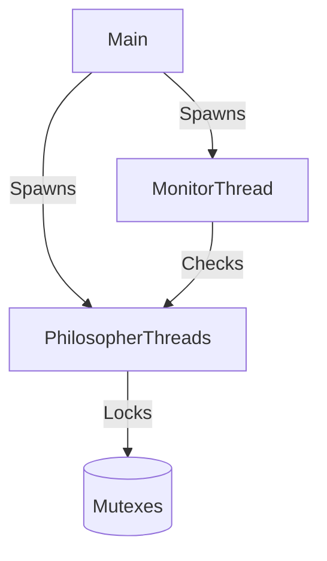

# Philosophers 🤔
**"Never thought philosophy could be so deadly."**  

  
*The classic synchronization problem brought to life with threads and mutexes.*

---

### Table of Contents  
- [Overview](#overview)  
- [Solution](#solution)  
- [Installation](#installation)  
- [Usage](#usage)  
- [Rules](#rules)  
- [Output Format](#output-format)  

---

### Overview  
Simulate the **Dining Philosophers Problem** where each philosopher (thread) alternates between:  
- 🍝 **Eating** (requires two forks)  
- 💭 **Thinking**  
- 😴 **Sleeping**  

Prevent deadlocks and starvation using:  
- **1 mutex per fork**  
- **1 monitor thread** to check starvation  

---

### Solution  

**Key Features**:  
- Monitor thread detects if any philosopher exceeds `time_to_die` without eating.  
- Thread-safe logging with timestamp precision.  
- Zero global variables (fully compliant).  

---

### Installation  
```bash  
git clone https://github.com/mcatalan15/philosophers.git && cd philosophers  
make  
```  
**Requirements**:  
- C compiler (`gcc`)  
- POSIX threads (`pthread`)  

---

### Usage  
```bash  
./philo <number_of_philos> <time_to_die> <time_to_eat> <time_to_sleep> \  
         [optional: meals_needed]  
```  
**Example**:  
```bash  
./philo 4 800 200 200  # Stops when a philosopher dies  
./philo 5 800 200 200 7  # Stops after all eat 7 times  
```  

---

### Rules  
1. **Forks = Philosophers** (each fork is a mutex).  
2. Philosophers pick forks in **left-right order** (prevents circular wait).  
3. Logs show real-time status with millisecond precision:  
   ```  
   1000 1 has taken a fork  
   1000 2 is eating  
   1200 2 is sleeping  
   ```  
4. **No data races** (strict mutex protection).  

---

### Output Format  
Every action prints:  
`<timestamp_ms> <philo_id> <action>`  
- **Valid actions**: `eating`, `sleeping`, `thinking`, `died`, `has taken a fork`.  
- **Death delay**: Printed within **10ms** of actual death.  

--- 

🛠️ **No bonuses** implemented—focus on a flawless mandatory part!  

--- 

**Why It Works**:  
- The **monitor thread** continuously checks last-meal times, triggering death if starvation is detected.  
- **Mutexes** ensure forks are atomic.  
- **No global state** means zero shared memory issues.  

--- 

🚀 **Run it and watch philosophers dance (or perish)!**  

